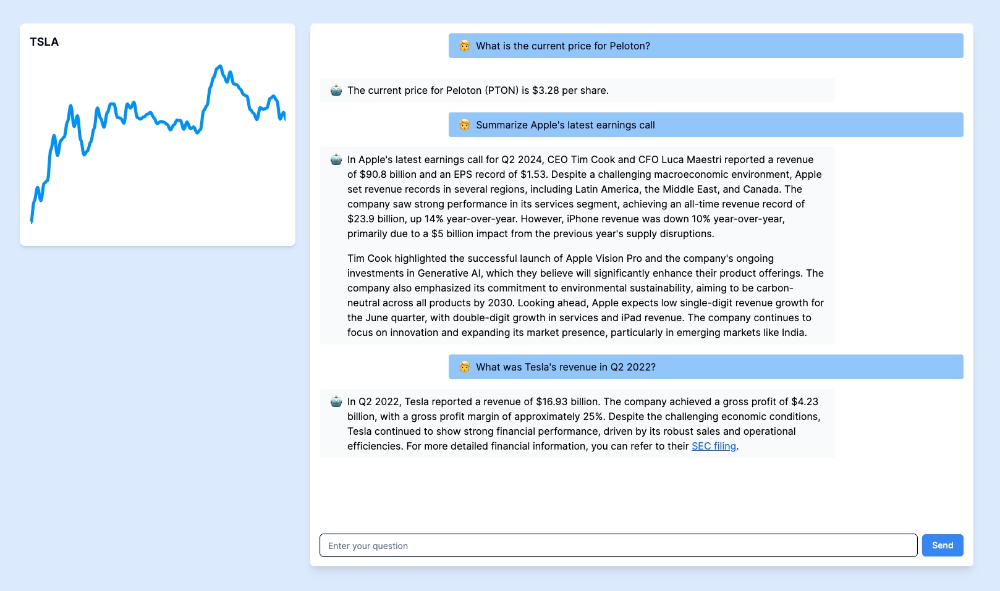

# `fmp-bot`



This is a [Next.js](https://nextjs.org/) project bootstrapped with [`create-next-app`](https://github.com/vercel/next.js/tree/canary/packages/create-next-app).

## Getting Started

First, use the Doppler CLI to login. You may use `.env.example` as a template
for the secrets you'll need.

Then, install dependencies with your favorite package manager and run the project
with one of the following commands:

```bash
npm run dev
# or
yarn dev
# or
pnpm dev
# or
bun dev
```

## Assignment
Use Open AI’s API alongside [FMP’s financial data API](https://site.financialmodelingprep.com/developer/docs) to answer
prompts such as “Summarize Apple’s latest  earnings call” or “What was Tesla’s revenue for Q2 2023". When answering
questions pulling transcripts please make sure to summarize the transcript from FMP.

Open [http://localhost:3000](http://localhost:3000) with your browser to see the result.
